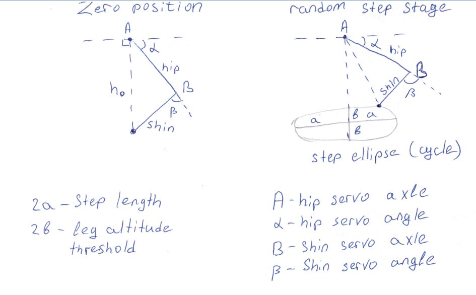

#### Robo-cat project

The cat robot based on raspberry pi and pca9685 16 channel pwm board.

Now this is a first alpha version, just for test the hardware.

We use modified ServoPi library from here (ServoPi.py file):
https://github.com/abelectronicsuk/ABElectronics_Python_Libraries

The `keyboard` module is used for control in 'play'  mode, so it requires root privileges.
This is just cause keyboard planned to use only on alpha version, so
i do not want to spend time to search 'non root' method for keyboard scan
for temporary solution. In beta version i would plane to add some "api"
for control, and to realize the control through lan/wi-fi using that api 

For dev install we need to prepare environment on a raspberry pi:
```bash
sudo apt-get update
sudo apt-get install -y git net-tools wget curl python3 python3-venv python3-pip mc
mkdir catty-venv
python3 -m venv ~/catty-venv
cd ~/catty-venv/
 . bin/activate
pip3 install smbus2 keyboard RPi.GPIO
```

and download the project.
```bash
git clone https://github.com/eugenosm/robo-cat.git
```

The main file is `catty.py`.
Usage:
```bash
sudo python3 catty.py play [--calculated [--h0=<h0>] [--a=<a>] [-b=<b>] [-hip=<hip>] [-shin=<shin>] [-stages=<stages>]] 
 start robot and control it with 'wsad'. exit is '~' key
  -h0 <h0>, --h0=<h0>                  zero pointed leg height
  -a <a>, --a=<a>                      step ellipse length
  -b <b>, --b=<b>                      step ellipse height
  -hip <hip>, --hip=<hip>              hip bone length
  -shin <shin>, --shin=<shin>          shin bone length
  -stages <stages>, --stages=<stages>  servo stages per step cycle(ellipse). must be multiply of 4

 
python3 catty.py adjust <channel> <position>
 for diagnostic/adjust pourpose we can set any of 16 servos to any position
 channel - 1..16
 position 0..180 degree  
```

#### Step and leg geometry drafts

